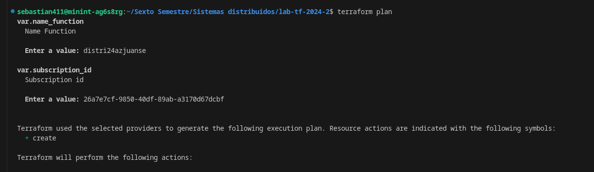
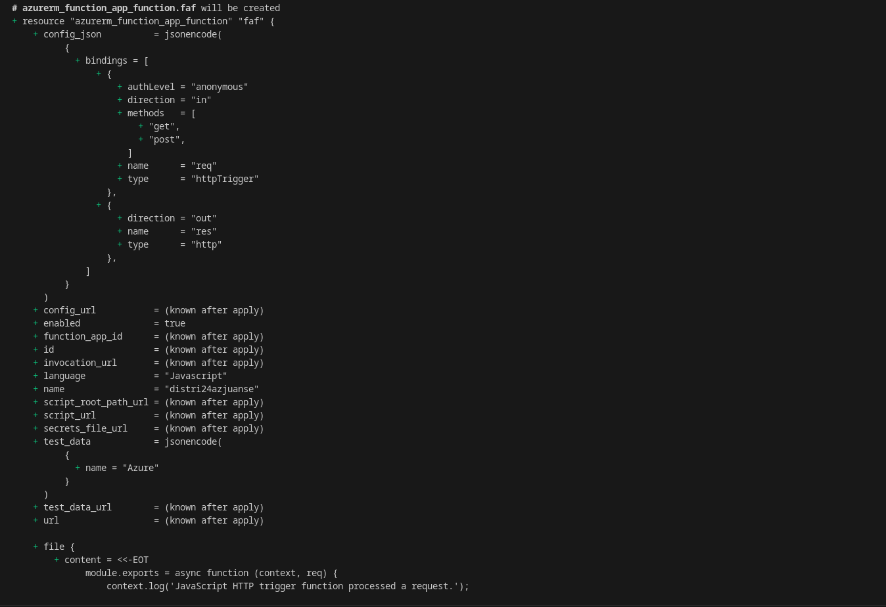
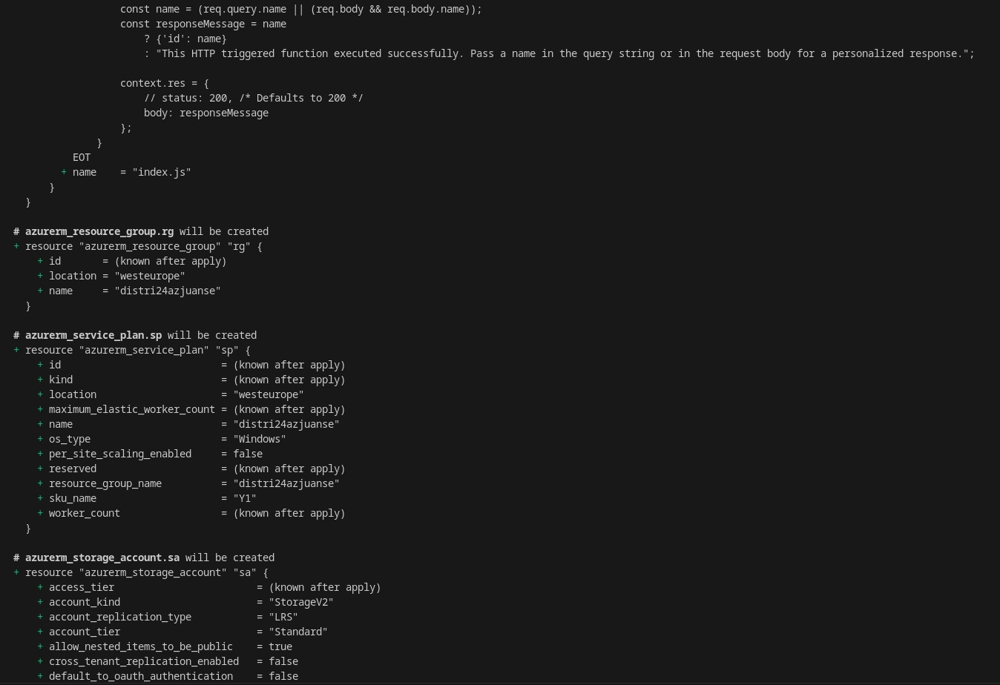
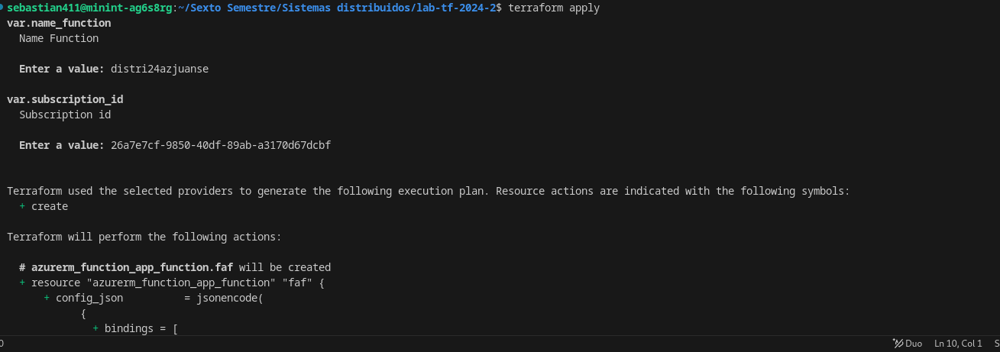
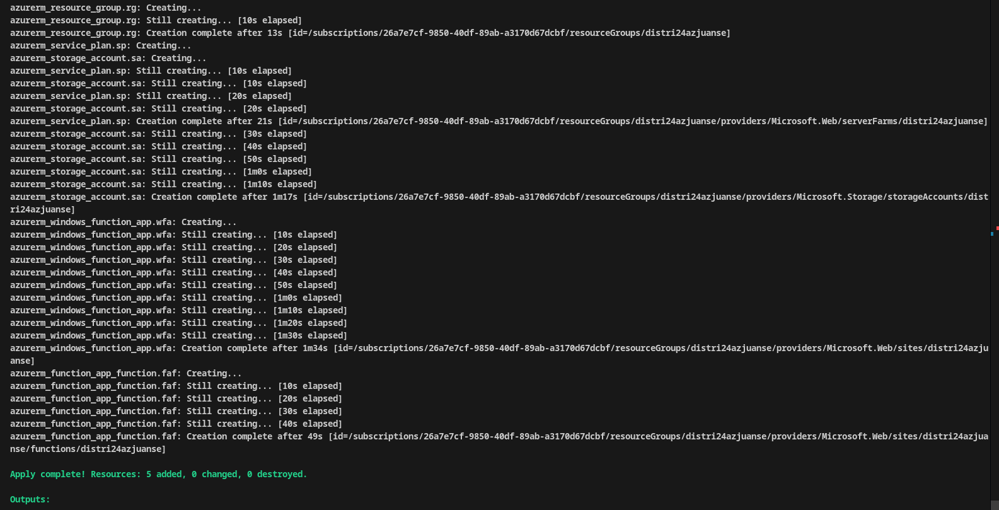
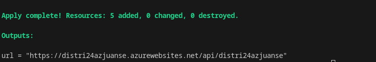
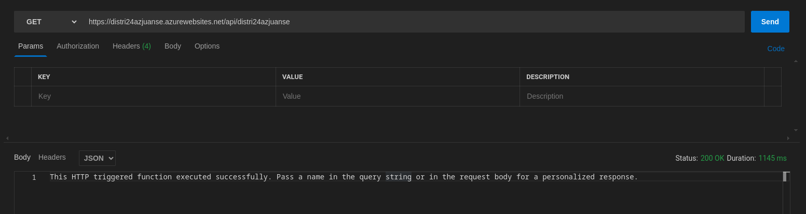

# 🌐 Laboratorio de Despliegue de Azure Function con Terraform 🚀

En este laboratorio, configuramos el **CLI de Azure** y desplegamos una **Azure Function** usando **Terraform**. A continuación, se detallan los pasos y los resultados obtenidos durante el despliegue.

## 📁 Configuración y Ejecución de Terraform Plan

El primer paso fue inicializar y ejecutar el comando `terraform plan` para visualizar los cambios que Terraform realizaría en la infraestructura. Este comando muestra el plan de despliegue y los recursos que se crearán.

```bash
terraform plan
```

### 🌟 Salida del Terraform Plan - Parte 1

Esta parte nos muestra los recursos que **Terraform** planea crear, tales como el **Resource Group** y la **Storage Account**.



### 🌟 Salida del Terraform Plan - Parte 2

Se continúa con la información sobre otros recursos, como el **Service Plan** y la **Function App**.



### 🌟 Salida del Terraform Plan - Parte 3

Finalmente, vemos los recursos adicionales que se despliegan con la **Function App** y su configuración.



---

## 🚀 Ejecución de Terraform Apply

Con el plan revisado, procedimos a ejecutar `terraform apply` para aplicar los cambios en la infraestructura.

```bash
terraform apply
```

### 🌟 Ejecución de Terraform Apply - Parte 1

Terraform comienza a desplegar los recursos en Azure. Esta parte muestra el inicio del proceso de creación de los recursos.



### 🌟 Ejecución de Terraform Apply - Parte 2

Aquí se muestra el progreso, incluyendo la creación de la **Function App** y otros componentes relacionados.



---

## 🌐 URL Generada por la Function App

Una vez completado el despliegue, **Terraform** genera la URL de acceso a la **Function App**. Esta URL permite invocar la aplicación de manera pública.

```bash
output "function_app_url" {
  value = azurerm_function_app.function_app.default_hostname
}
```

### 🌟 URL de la Function App

Aquí puedes ver la URL que se generó tras el despliegue exitoso:



---

## 🛠️ Prueba en Postman

Para verificar el correcto funcionamiento de la **Function App**, realizamos una prueba con **Postman**, enviando una solicitud HTTP a la URL generada. El resultado muestra que la aplicación está respondiendo correctamente.

### 🌟 Prueba con Postman

La prueba fue exitosa y recibimos la respuesta esperada de la **Function App**.



---

## 📊 Resultados

- **Terraform Plan** se ejecutó correctamente, mostrando los recursos que se desplegarían en **Azure**.
- **Terraform Apply** creó y configuró los recursos, incluyendo una **Function App** funcional.
- La **Function App** fue probada satisfactoriamente utilizando **Postman**.

## 🎯 Conclusión

Este laboratorio demostró la eficacia de usar **Terraform** para gestionar y desplegar recursos en **Azure**, automatizando el proceso de creación de una **Azure Function**. La infraestructura como código permite un despliegue más rápido y organizado de servicios en la nube.
